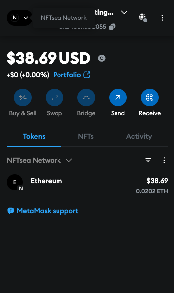

# NFTsea

NFTsea is a NFT marketplace built on top of NFTsea Network Rollup using Espresso Rollup.The NFTsea Network is a espresso rollup designed to facilitate cross-chain NFT transactions, providing a scalable and efficient solution for managing NFTs across different blockchain networks like Ethereum, Arbitrum, and more.

## Configuration

### Network Configuration

you can connect to NFTsea Network by using the following configuration:

- **Network Name**: NFTsea Network
- **RPC URL**: http://47.130.1.66:8550/
- **Chain ID**: 336699
- **Currency Symbol**: ETH

### Brige ETH from Arbritum Sepolia to NFTsea Network

you can bridge ETH from Arbritum Sepolia to NFTsea Network by using the following configuration:

```
cast send --rpc-url https://arbitrum-sepolia-rpc.publicnode.com 0xA13a71A6995254950BcdE216F675B867C7EB9882 'depositEth() external payable returns (uint256)' --private-key WALLET_PRIVATE_KEY_WITH_ARBITRUM_SEPOLIA_ETH  --value 1000000000000 -vvvv
```

once you have bridged the ETH, you can see the balance of your wallet in NFTsea Network by using the following command:

```
cast balance --rpc-url http://47.130.1.66:8550/ YOUR_WALLET_ADDRESS
```

or you see balance in metamask by switching to NFTsea Network



### NFT Marketplace Payment Processor

| Chain            | Contract Address                           | Block Explorer Link                                                                                             |
| ---------------- | ------------------------------------------ | --------------------------------------------------------------------------------------------------------------- |
| Ethereum Sepolia | 0xc645bC39C280bCF02828a9e785C27cBe93365640 | [Block Explorer](https://eth-sepolia.blockscout.com/address/0xc645bC39C280bCF02828a9e785C27cBe93365640)         |
| Arbitrum Sepolia | 0x364D49ADd9425e17e4B443BD06890C289F23F1ed | [Arbitrum Explorer](https://arbitrum-sepolia.blockscout.com/address/0x364D49ADd9425e17e4B443BD06890C289F23F1ed) |
| Scroll Sepolia   | 0xC284Be07898768F0818aAeC84A0bD95Bc5275670 | [Scroll Explorer](https://scroll-sepolia.blockscout.com/address/0xC284Be07898768F0818aAeC84A0bD95Bc5275670)     |
| Optimism Sepolia | 0xC284Be07898768F0818aAeC84A0bD95Bc5275670 | [Optimism Explorer](https://optimism-sepolia.blockscout.com/address/0xC284Be07898768F0818aAeC84A0bD95Bc5275670) |

## Features

- ⚡️ **Next.js 14+** with App Router
- 🌈 **RainbowKit v2** for beautiful wallet connection UI
- 🧰 **wagmi v2** for React hooks for Ethereum
- 🔐 **SIWE (Sign-In with Ethereum)** authentication
- 🗃️ **Prisma ORM** with PostgreSQL integration
- 🎨 **shadcn/ui** components with Tailwind CSS
- 🌙 **Dark mode** support with next-themes
- 🔍 **Type-safe environment variables** with t3-env
- 📊 **React Query** for data fetching
- 🧩 **TypeScript** for type safety
- 🔧 **ESLint & Prettier** for code quality

## Demo

Check out the live demo: [Next14 Web3 Template](https://github.com/0xShikhar/next14-web3-template)

## Getting Started

### Prerequisites

- Node.js 18+ (LTS recommended)
- pnpm, npm, or yarn (pnpm recommended)
- PostgreSQL database (for Prisma)

## Key Components

### Web3 Integration

- **RainbowKit**: Provides a beautiful, customizable wallet connection UI.
- **wagmi**: React hooks for Ethereum, making it easy to interact with smart contracts.
- **SIWE**: Sign-In with Ethereum for secure authentication.
- **Custom Chain Support**: Easily add custom blockchain networks.

### UI Components

- **shadcn/ui**: High-quality, accessible UI components built with Radix UI and Tailwind CSS.
- **Responsive Design**: Mobile-friendly layouts with Tailwind CSS.
- **Dark Mode**: Seamless light/dark mode switching with next-themes.

### Backend Integration

- **Prisma ORM**: Type-safe database client for PostgreSQL.
- **API Routes**: Next.js API routes for backend functionality.
- **Middleware**: Authentication middleware for protected routes.

## Customization

### Styling

This template uses Tailwind CSS for styling. You can customize the theme in `tailwind.config.ts`:

### Installation

1. Clone the repository:

   ```bash
   git clone https://github.com/0xShikhar/next14-web3-template.git
   ```

2. Install dependencies:

   ```bash
   cd next14-web3-template
   pnpm install
   # or
   npm install
   # or
   yarn install
   ```

3. Set up environment variables:
   Create a `.env.local` file in the root directory with the following variables:

   ```
   JWT_SECRET=your_jwt_secret
   ```

4. Generate Prisma client:

   ```bash
   npx prisma generate
   ```

5. Run the development server:
   ```bash
   pnpm dev
   # or
   npm run dev
   # or
   yarn dev
   ```

## Deployment

### Vercel

The easiest way to deploy your Next.js app is to use the [Vercel Platform](https://vercel.com/new).

1. Push your code to a Git repository (GitHub, GitLab, BitBucket).
2. Import the project to Vercel.
3. Add your environment variables.
4. Deploy!

### Other Platforms

You can also deploy to other platforms that support Next.js:

1. Build the application:

   ```bash
   pnpm build
   # or
   npm run build
   # or
   yarn build
   ```

2. Start the production server:
   ```bash
   pnpm start
   # or
   npm run start
   # or
   yarn start
   ```

## Contributing

Contributions are welcome! Please feel free to submit a Pull Request.

1. Fork the repository.
2. Create your feature branch (`git checkout -b feature/amazing-feature`).
3. Commit your changes (`git commit -m 'Add some amazing feature'`).
4. Push to the branch (`git push origin feature/amazing-feature`).
5. Open a Pull Request.

## License

This project is licensed under the MIT License - see the LICENSE file for details.

## Acknowledgments

- [Next.js](https://nextjs.org/)
- [RainbowKit](https://www.rainbowkit.com/)
- [wagmi](https://wagmi.sh/)
- [Prisma](https://www.prisma.io/)
- [shadcn/ui](https://ui.shadcn.com/)
- [Tailwind CSS](https://tailwindcss.com/)
- [TypeScript](https://www.typescriptlang.org/)

## Author

- **0xShikhar** - [GitHub](https://github.com/0xShikhar) | [Twitter](https://twitter.com/0xshikhar)

---

Built with ❤️ by [0xShikhar](https://0xshikhar.xyz)

```

```
